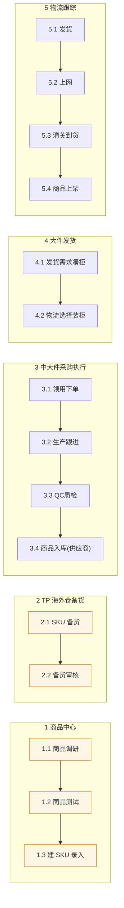

```mermaid
%% 横向流程图，分级显示并美化
graph LR
  %% 一级分组 1 商品中心
  subgraph S1["1 商品中心"]
    S1_1["1.1 商品调研"]
    S1_2["1.2 商品测试"]
    S1_3["1.3 建 SKU 录入"]
  end

  %% 一级分组 2 TP 海外仓备货
  subgraph S2["2 TP 海外仓备货"]
    S2_1["2.1 SKU 备货"]
    S2_2["2.2 备货审核"]
  end

  subgraph S3["3 中大件采购执行"]
    S3_1["3.1 领用下单"]
    S3_2["3.2 生产跟进"]
    S3_3["3.3 QC质检"]
    S3_4["3.4 商品入库(供应商)"]
  end

    subgraph S4["4 大件发货"]
    S4_1["4.1 发货需求凑柜"]
    S4_2["4.2 物流选择装柜"]
  end

    subgraph S5["5 物流跟踪"]
    S5_1["5.1 发货"]
    S5_2["5.2 上网"]
    S5_3["5.3 清关到货"]
    S5_4["5.4 商品上架"]
  end

  %% 组内流程（1.1 -> 1.2 -> 1.3）
  S1_1 --> S1_2 --> S1_3
  S2_1 --> S2_2
  S3_1 --> S3_2 --> S3_3 --> S3_4
  S4_1 --> S4_2
  S5_1 --> S5_2 --> S5_3 --> S5_4


  %% 美化样式
  classDef level1 fill:#f0f9ff,stroke:#2b7bb9,stroke-width:1px;
  classDef level2 fill:#fff7e6,stroke:#d67b00,stroke-width:1px;
  class S1_1,S1_2,S1_3,S2_1,S2_2 level2;
```